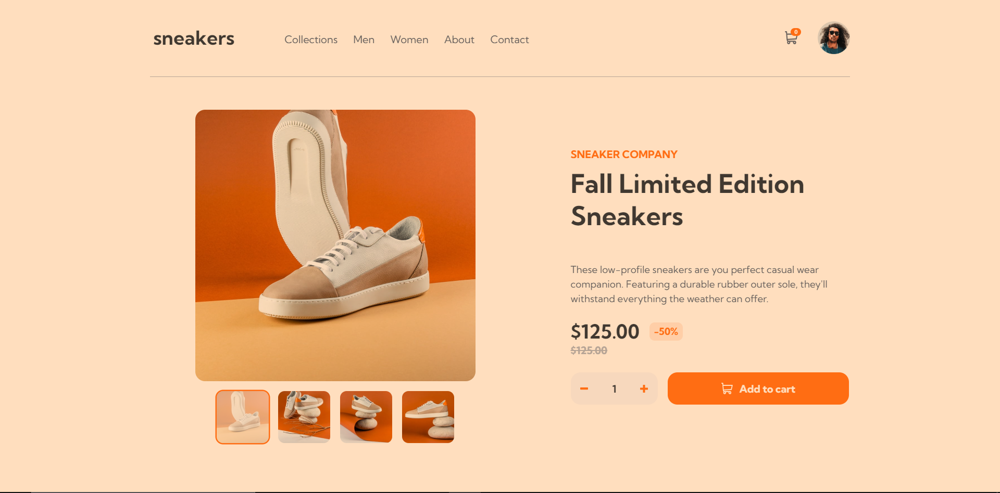

# Frontend Mentor - E-commerce product page solution

This is a solution to the [E-commerce product page challenge on Frontend Mentor](https://www.frontendmentor.io/challenges/ecommerce-product-page-UPsZ9MJp6). Frontend Mentor challenges help you improve your coding skills by building realistic projects.

## Table of contents

- [Overview](#overview)
  - [The challenge](#the-challenge)
  - [Screenshot](#screenshot)
  - [Links](#links)
- [My process](#my-process)
  - [Built with](#built-with)
  - [What I learned](#what-i-learned)
  - [Continued development](#continued-development)
  - [Useful resources](#useful-resources)
- [Author](#author)
- [Acknowledgments](#acknowledgments)

**Note: Delete this note and update the table of contents based on what sections you keep.**

## Overview

### The challenge

Users should be able to:

- View the optimal layout for the site depending on their device's screen size
- See hover states for all interactive elements on the page
- Open a lightbox gallery by clicking on the large product image
- Switch the large product image by clicking on the small thumbnail images
- Add items to the cart
- View the cart and remove items from it

### Screenshot

### Links

- Solution URL: [Solution](https://github.com/FloratobyDev/Simple-Ecommerce-Page)
- Live Site URL: [Live Site](https://classy-gelato-bc44f6.netlify.app)

## My process
 Typically, I would take a look at the design for a long time, and plan out what the HTML structure should look like for the website. Then, implement it and see if
 it works as observed. Once I know that it works, I'll proceed working on the style of the site section by section. Then implement the behavior and voila! Site done.

### Built with

- Semantic HTML5 markup
- Flexbox
- Desktop-first workflow
- React Hooks - Context, Ref, Effect, and State.
- [React](https://reactjs.org/) - JS library
- [Sass](https://sass-lang.com/) - CSS Precompiler

### What I learned
 - Learned more about SASS' interpolation, At-Rules, Values, and Operators.
 - Learned more about CSS Methodologies. I didn't apply much here though, but I'll add some rules next project.
 - Learned more about CSS background shorthand, box-shadow shorthand, user-select, pointer-events, grid auto-fit and auto-fill and more.
 - Learned more about TypeScript and why I should use it on my next project -- because I can actually tell what data-type/class I'm using or returning.
 - Learned more about Mobile-First workflow -- apparently, it's easier to design the web that way first.
 - Modularized code in React. Cut them into chunks.
 - Learned more about the filter property. Apparently there's a pretty handy [Codepen Project](https://codepen.io/sosuke/pen/Pjoqqp) that `converts a Hex Color into a value that filter can take.`
 - Learned a lil' bit about REGEX. I had to use it to find a number in an image file. I learnt it before but it's much easier to just take a look at it and create a pattern that way rather than memorizing everything. As long as I know it exist, then that's good enough, I think ㋡.
 - Learned more about Context Hook. I know how to use it in my code but I should learn more about useCallback and useMemo so that re-render doesn't get too expensive.
 - Learned that I should go find a job :) .

### Continued development

 **It's perfekt!** (Definitely not).

### Useful resources

- [React](https://reactjs.org/) - Default definitions of React Hooks. 
- [Sass](https://sass-lang.com/) - Helped me understand what it's all about.
- [MDN](https://developer.mozilla.org/en-US/) - Helped me understand grid auto-fit vs. auto-fill, and many more different properties.
- [W3Schools](https://www.w3schools.com/) - Same as MDN.
- [CSSTricks](https://css-tricks.com/) - Great site. A different way of explaining things, which I like.
- [CSS Methodologies](https://www.webfx.com/blog/web-design/css-methodologies/) - Different kinds of CSS methodologies.
- [Mobile First Workflow](https://www.techmagic.co/blog/best-practices-for-mobile-first-design/) - This is where I learned more about the Mobile-first workflow.
 concept.

## Author

- Website - [Michael Mushrush](https://www.michaelmushrush.tech)

## Acknowledgments

Thanks Frontend Mentor! :)